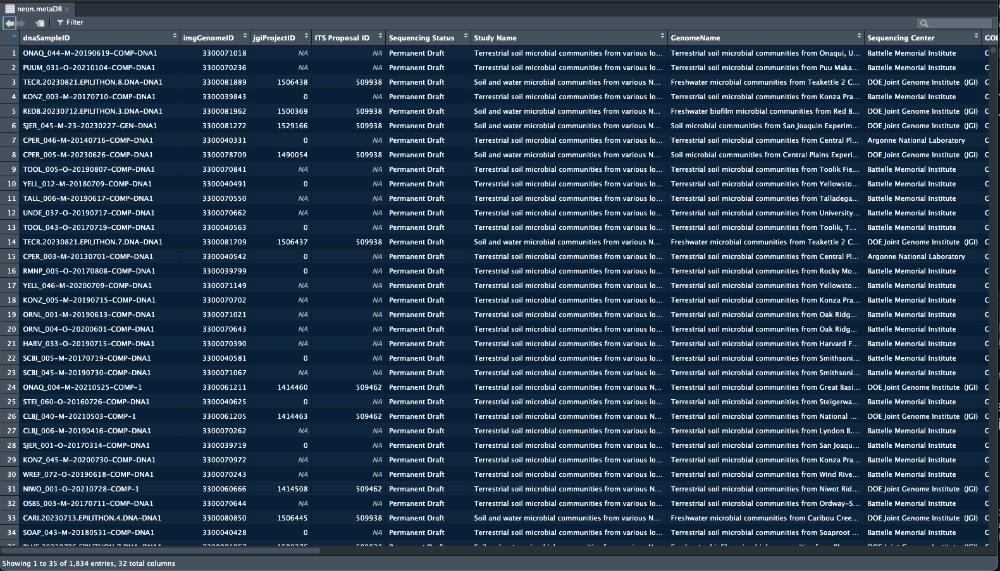

# Getting started with NEON metagenomic data


## Accessing NEON samples on the JGI IMG data portal

### NEON metagenome database

A table (`neon.metaDB`) has been added to the phyloNEON package that contains over 1,800 NEON metagenome samples that are on the JGI IMG data portal. This includes legacy data as well as all samples that are part of the [JGI CSP award](https://www.neonscience.org/impact/observatory-blog/update-changing-neon-microbial-data), which covers deep sequencing and analysis by JGI of all NEON metagenome samples collected in 2023 and 2024. Included in the table are several fields with JGI metadata and statistics for each sample, such as `Sequencing Method`, `GenomeSize`, `GeneCount`, and number of bins (`metaBATbinCount`). Also included are some NEON variables such as `siteID` and `collectDate`, as well as multiple environmental terms assigned to each sample according to ENVO specifications (e.g. `Ecosystem Category`, `Ecosystem Type`, `Specific Ecosystem`). The table also has reference codes for the Genome Online Database (GOLD), including `GOLD Analysis Project ID` and `GOLD Study ID`; and the taxon OID (`imgGenomeID`) that allows accessing the sample on the JGI IMG data portal.

This table is available when you load the package:


```
library(phyloNEON)

View(neon.metaDB)

```

Here is a partial view of the table: 




You can search the table to find NEON samples that are on JGI.

### Opening web pages on the JGI IMG data portal 

We have added a function, `openIMG` on this package that enables the user to search the ***neon.metaDB*** database and open the landing page for each sample (limited to 15 queries at a time). 


