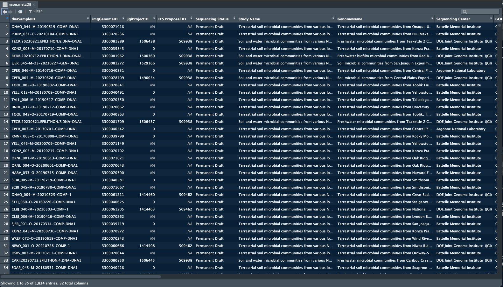
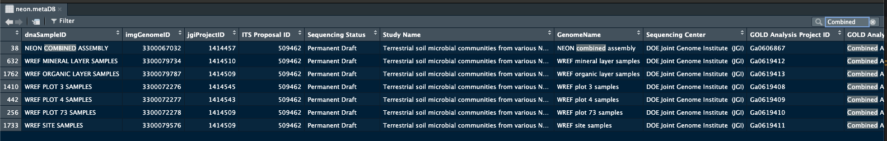

# Getting started with NEON metagenomic data

We have provided some tools and guidelines to help users access NEON metagenomic data on the JGI and NMDC data portals.

## Accessing NEON samples on the JGI IMG data portal

### NEON metagenome database

A table (`neon.metaDB`) has been added to the phyloNEON package that contains over 1,800 NEON metagenome samples that are on the JGI IMG data portal. This includes legacy data as well as all samples that are part of the [JGI CSP award](https://www.neonscience.org/impact/observatory-blog/update-changing-neon-microbial-data), which covers deep sequencing and analysis by JGI of all NEON metagenome samples collected in 2023 and 2024. Included in the table are several fields with JGI metadata and statistics for each sample, such as `Sequencing Method`, `GenomeSize`, `GeneCount`, and number of bins (`metaBATbinCount`). Also included are some NEON variables such as `siteID` and `collectDate`, as well as multiple environmental terms assigned to each sample according to ENVO specifications (e.g. `Ecosystem Category`, `Ecosystem Type`, `Specific Ecosystem`). The table also has reference codes for the Genome Online Database (GOLD), including `GOLD Analysis Project ID` and `GOLD Study ID`; and the taxon OID (`imgGenomeID`) that allows accessing the sample on the JGI IMG data portal.

This table is available when you load the package:


```
library(phyloNEON)

View(neon.metaDB)

```

Here is a partial view of the table: 




You can search the table to find NEON samples that are on JGI.


About a third of the NEON samples on the JGI portal were sequenced by JGI and have much increased depth compared to the older samples. 
If you wanted to focus on these samples, you can filter them by `Sequencing Center` or `ITS Proposal ID`:

```
query3 <- neon.metaDB %>%
  dplyr::filter(`Sequencing Center` == 'DOE Joint Genome Institute  (JGI)')

# or by ITS Proposal ID

query3a <- neon.metaDB %>%
  dplyr::filter(`ITS Proposal ID` %in% c('509938','509462'))


```


You can use tidyverse as well as other R packages to search the table and create a list of samples. 

### Accessing NEON co-assemblies

In the pilot phase of the collaboration with JGI, several combined assemblies of NEON samples were done. These are also listed in ***neon.metaDB***



Here is how you can filter the table for the co-assemblies and access. The `dnaSampleID`s for the combined assemblies is different from the rest, as it is composed of more than one sample. But you can still open the IMG pages, either separately or as a group. 

```
library(phyloNEON)
library(tidyverse)

# or filter the database and open them all
neon.coassemblies <- neon.metaDB %>%
  dplyr::filter(`GOLD Analysis Project Type` == 'Combined Assembly')


```

These examples should help you get started. Please open an issue on this repo if you have questions


